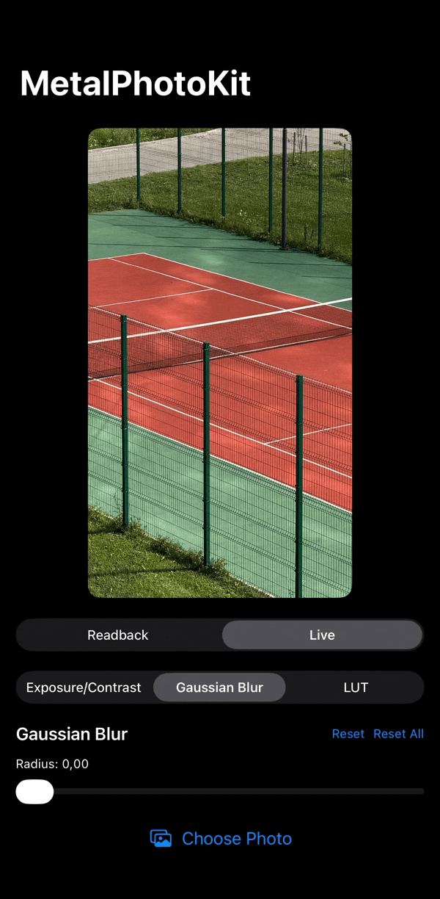
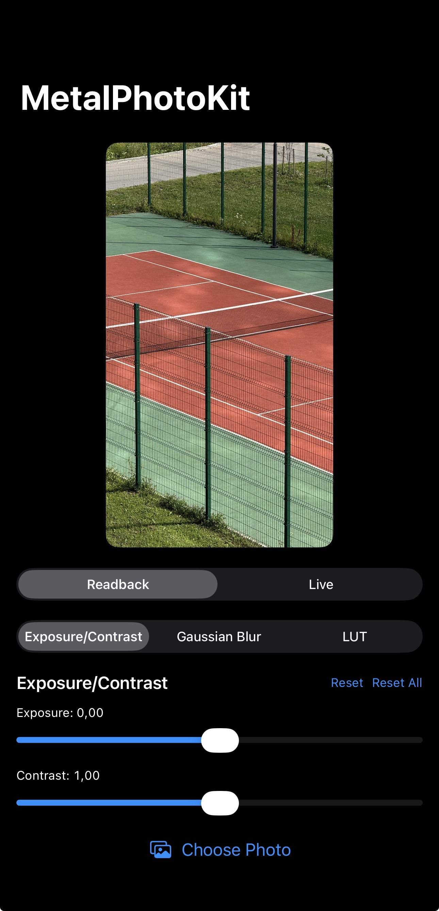
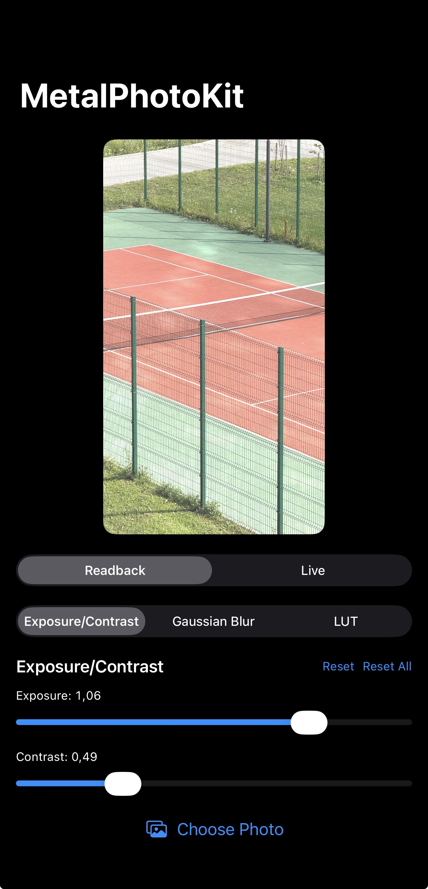
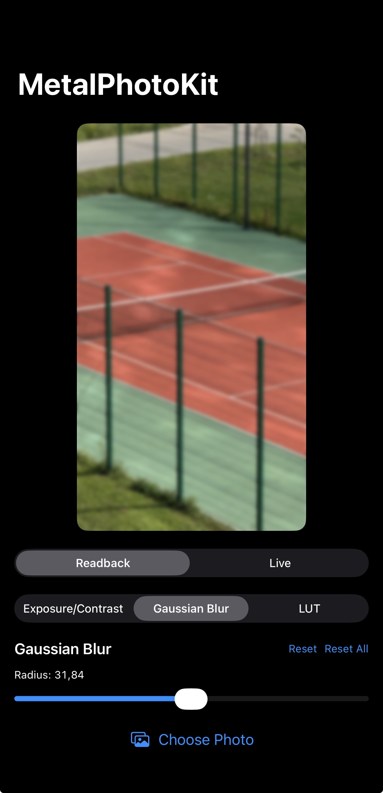
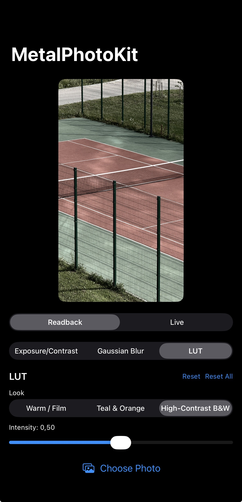

# MetalPhotoKit

[](https://github.com/synthpuh/MetalPhotoKit/actions/workflows/ci.yml)

GPU-accelerated photo processing built on Metal: a composable filter chain,
explicit texture pooling, and two render paths — one for CPU readback
(export, share, further processing), one for a live on-screen preview that
never leaves GPU memory.

No third-party dependencies. Swift 6.1+, iOS 17+, macOS 14+, SPM only.
Builds in Swift 6 language mode with strict concurrency checking enabled.
The live preview view (`FilterChainMetalView`) is iOS-only; the filter chain,
texture pool and readback path run on both platforms.

## Demo



| Original | Exposure + contrast | Gaussian blur | LUT |
|---|---|---|---|
|  |  |  |  |

## Installation

```swift
dependencies: [
    .package(url: "https://github.com/synthpuh/MetalPhotoKit", from: "1.0.0")
]
```

## Quick start

```swift
import MetalPhotoKit

let context = try MetalContext()
let loader = TextureLoader(context: context)

let source = try loader.texture(from: myCGImage)

let chain = FilterChain(context: context, filters: [
    ExposureContrastFilter(exposure: 0.6, contrast: 1.15),
    GaussianBlurFilter(radius: 8),
])

let result = try chain.run(on: source)
let output = try loader.cgImage(from: result)

// `run` can hand back `source` itself unchanged (see "Texture pool
// ownership model" below) — never pool a texture you don't own.
if result !== source {
    context.returnTexture(result)
}
```

## Architecture

### `MetalContext`

Wraps an `MTLDevice` and its `MTLCommandQueue`, and owns two caches behind
them: a compute pipeline cache (compiles each shader function once, keyed by
name, and reuses the `MTLComputePipelineState` on every later call) and a
texture pool (`checkoutTexture`/`returnTexture`). `MetalContext` itself is a
value type — cheap to pass around like a handle — but `@unchecked Sendable`,
because both caches are reference-typed underneath: every copy shares the
same pipeline cache and texture pool rather than rebuilding its own.

### The `Filter` protocol

```swift
public protocol Filter {
    func apply(to input: any MTLTexture, commandBuffer: any MTLCommandBuffer, context: MetalContext) throws -> any MTLTexture
}
```

A filter encodes its own compute pass (or passes) into a command buffer it's
handed, and returns the texture it wrote to. Three ship with the package:
`ExposureContrastFilter`, `GaussianBlurFilter` (separable, two 1D passes),
and `LUTFilter` (3D color lookup table, loaded via `LUTLoader` from a
`.cube` file or the bundled neutral identity table). Every filter has a
no-op fast path at some identity parameter value —
`ExposureContrastFilter(exposure: 0, contrast: 1)`, `GaussianBlurFilter(radius: 0)`,
`LUTFilter(intensity: 0)` — that hands back `input` untouched
without touching the GPU. Note this identity value isn't always each
filter's own `init` default: `LUTFilter`'s default `intensity` is `1`
(fully graded), since a LUT you bothered to construct is presumably one you
want applied; it's the demo app's own parameter defaults, not the filter's,
that are chosen to make an untouched photo pass through unchanged.

### `FilterChain`

Runs an ordered list of filters inside a single command buffer, threading
each filter's output into the next filter's input, then commits and calls
`waitUntilCompleted()`. Every filter in the chain shares that one command
buffer rather than getting its own — the GPU driver sees the whole chain as
one scheduling unit, with no cross-buffer synchronization between passes.

### Texture pool ownership model

`checkoutTexture`/`returnTexture` is a manual handoff, not automatic
reference counting: a texture only comes back to the pool when you call
`returnTexture` on it, and you may only do that once the GPU work touching
it has actually finished — from a command buffer's completion handler, not
right after encoding. `FilterChain.run` handles this correctly for every
*intermediate* texture it creates internally, returning each one from a
`addCompletedHandler` closure once the chain's single command buffer
finishes. The *final* output, though, is handed to the caller, whose
responsibility it becomes.

One sharp edge falls out of this: if every filter in the chain is a no-op
for its current parameters (or the filter list is empty), `run(on:)` returns
`source` itself, completely unchanged — there's no pooled output to hand
back. A caller that unconditionally calls `context.returnTexture(result)`
after every run will, on that path, return the caller's *own* source texture
to the pool — and the next unrelated checkout can then hand that same
texture back out to be overwritten mid-flight. Always check
`result !== source` before pooling.

## The two render paths

The same `Filter`/`FilterChain` API drives two different outputs. Which one
to reach for depends on what happens to the pixels next.

### Readback — `FilterChain.run(on:)` + `TextureLoader.cgImage(from:)`

`run(on:)` writes into an ordinary `MTLTexture`; `TextureLoader.cgImage`
copies it back to CPU memory with `getBytes` and wraps the bytes in a
`CGImage`. Use this whenever the destination is CPU-side — exporting a
photo, displaying it in a plain SwiftUI `Image`, compressing it, handing it
to a share sheet. It's a full GPU→CPU synchronization and copy on every
call: cheap enough for "process once and look at the result," wasteful if
you'd call it every frame.

### Live — `FilterChainMetalView` (iOS)

A `UIViewRepresentable` around an `MTKView`. It runs the same chain into an
intermediate texture, then resamples that texture straight into the
drawable's own texture via `MPSImageBilinearScale` and presents — the pixels
never leave GPU memory, so there's no `getBytes`, no `CGImage`, no CPU copy
at all. The view is on-demand rather than free-running a display link:
`isPaused = true` and `enableSetNeedsDisplay = true`, so a frame is drawn
only when `updateUIView` calls `setNeedsDisplay()`, which it does whenever
SwiftUI hands the view new filters or a new source texture.

**When to use which:** readback for anything that ends up as a static image
consumed off-GPU; live for anything actually on screen while parameters
change — a slider-driven preview, for instance. The benchmarks below
quantify the gap: the live path runs ~1.8–2× faster end to end, purely from
skipping the CPU round trip. On a 12MP photo on an A17 Pro, that gap is the
difference between fitting inside a 60fps frame budget and missing it
outright.

## Benchmarks

Produced by `BenchmarkCore` — the measurement logic lives in its own library
target so the same code runs from a CLI on macOS and from an on-device
XCTest in the demo app's test target.

```
swift run -c release metalphotokit-benchmark      # macOS
⌘U on the demo app's test target                  # iOS device
```

**Methodology.** Source images are procedurally generated gradients, not a
bundled asset, so the benchmark isn't limited to one file's resolution. Each
cell runs 3 warmup iterations (to pay one-time shader-compilation cost
before timing starts) followed by 10 measured iterations, reported as mean ±
standard deviation. GPU time comes from
`MTLCommandBuffer.gpuStartTime`/`gpuEndTime`, read after
`waitUntilCompleted()`. This has to run on real hardware — the iOS Simulator
has no GPU to source command buffer timestamps from. iOS figures below are
from the second consecutive run on a cool, mains-powered device, built in
Release configuration.

### iOS — Apple A17 Pro (iPhone 15 Pro)

This is the target platform, and the table that matters.

#### Per-filter and full-chain GPU time

Chain = ExposureContrast → GaussianBlur(r=8) → LUT.

| Resolution | ExposureContrast | GaussianBlur (r=8) | LUT | Full chain |
|---|---|---|---|---|
| 1024×768 | 0.20 ± 0.21 ms | 1.47 ± 0.51 ms | 0.34 ± 0.03 ms | 1.83 ± 0.67 ms |
| 2048×1536 | 0.55 ± 0.03 ms | 2.68 ± 0.41 ms | 0.77 ± 0.06 ms | 3.64 ± 0.24 ms |
| 4032×3024 | 2.23 ± 0.06 ms | 9.60 ± 0.23 ms | 2.49 ± 0.10 ms | 13.75 ± 0.24 ms |

At 1024×768 the per-filter timings sit close to command-buffer scheduling
noise (a stddev larger than the mean on the cheapest filter) — treat that
row as "a fraction of a millisecond," not as precise numbers.

#### Readback path vs. live drawable path

Readback = chain + `getBytes` + `CGImage` (the path any non-live consumer
takes). Live = chain + GPU resample into a 1170×2532 drawable-sized texture
in one command buffer, no CPU copy — what `FilterChainMetalView` does per
frame.

| Resolution | Chain GPU | Readback CPU (getBytes+CGImage) | Readback path total | Live path GPU | Live vs. readback |
|---|---|---|---|---|---|
| 1024×768 | 0.87 ± 0.03 ms | 1.43 ± 0.62 ms | 2.90 ± 0.65 ms | 1.53 ± 0.11 ms | 1.9× faster |
| 2048×1536 | 3.40 ± 0.06 ms | 4.64 ± 1.05 ms | 8.62 ± 1.02 ms | 4.34 ± 0.13 ms | 2.0× faster |
| 4032×3024 | 13.09 ± 0.29 ms | 13.14 ± 2.74 ms | 26.73 ± 2.85 ms | 14.96 ± 0.18 ms | 1.8× faster |

**The frame budget.** 60fps allows 16.7 ms per frame. On a full 12MP photo
the live path lands at ~15.0 ms — inside the budget, with very little
headroom. The readback path, at ~26.7 ms, cannot hit 60fps at that
resolution at all. At preview-sized inputs both paths are comfortable; the
gap only becomes decisive as resolution grows.

#### Gaussian blur radius sweep

Fixed resolution 2048×1536. The separable two-pass kernel does O(radius)
work per pixel, so GPU time is expected to scale roughly linearly with
radius rather than quadratically.

| Radius | GaussianBlur |
|---|---|
| r=2 | 1.13 ± 0.05 ms |
| r=4 | 1.53 ± 0.06 ms |
| r=8 | 2.47 ± 0.05 ms |
| r=16 | 4.29 ± 0.02 ms |
| r=32 | 8.12 ± 0.03 ms |

A 16× increase in radius costs 7.2× the time, and the measurements fit
`t ≈ 0.9 + 0.225·r` almost exactly — linear in radius, plus a fixed
per-dispatch overhead. A naive 2D convolution matched at r=2 would be
roughly 35× slower at r=32. That constant overhead is also why blur at
radius 0 isn't free, and why the no-op fast path exists.

### macOS — Apple M4 (10-core GPU), macOS 26.6.1

Desktop-class reference, for comparison. Roughly 2× faster than the A17 Pro
at 12MP, which is about what the hardware gap predicts.

| Resolution | ExposureContrast | GaussianBlur (r=8) | LUT | Full chain |
|---|---|---|---|---|
| 1024×768 | 0.13 ± 0.07 ms | 1.00 ± 0.19 ms | 0.29 ± 0.00 ms | 1.34 ± 0.25 ms |
| 2048×1536 | 0.27 ± 0.03 ms | 1.82 ± 0.31 ms | 0.46 ± 0.10 ms | 2.60 ± 0.35 ms |
| 4032×3024 | 0.95 ± 0.02 ms | 4.44 ± 0.08 ms | 0.97 ± 0.02 ms | 6.33 ± 0.06 ms |

| Resolution | Chain GPU | Readback CPU | Readback total | Live path GPU | Live vs. readback |
|---|---|---|---|---|---|
| 1024×768 | 0.38 ± 0.01 ms | 0.42 ± 0.26 ms | 1.01 ± 0.31 ms | 0.55 ± 0.00 ms | 1.9× faster |
| 2048×1536 | 1.64 ± 0.01 ms | 1.53 ± 0.38 ms | 3.44 ± 0.35 ms | 2.01 ± 0.09 ms | 1.7× faster |
| 4032×3024 | 6.39 ± 0.05 ms | 7.38 ± 1.38 ms | 14.06 ± 1.35 ms | 7.12 ± 0.10 ms | 2.0× faster |

| Radius | r=2 | r=4 | r=8 | r=16 | r=32 |
|---|---|---|---|---|---|
| GaussianBlur | 0.51 ms | 0.70 ms | 1.10 ms | 1.94 ms | 3.65 ms |

The same linear-in-radius shape appears on both GPUs, which is a useful
cross-check that the scaling is a property of the algorithm rather than of
one device's scheduler.

## Known optimization: filter at drawable resolution

The live path currently runs the full chain at *source* resolution and then
resamples the result down into the drawable. For a 12MP photo previewed on a
1170×2532 screen, that means doing roughly four times more per-pixel work
than the display can actually show.

Reversing the order — resample to drawable size first, then filter — would
cut the chain's ~13 ms at 12MP to roughly 3.5 ms, taking the whole live
frame from ~15 ms to well under 6 ms and restoring real headroom inside the
60fps budget. The output is visually indistinguishable at preview size;
full-resolution processing is only genuinely needed on export, where the
readback path already applies and a single-frame cost is acceptable.

This is measured, not assumed: the per-resolution table above is what made
the four-times-too-much-work ratio visible in the first place.

## Decisions & tradeoffs

**`MetalContext` is a value type wrapping reference-typed caches, rather
than a class.** Passing it around like `Int` or `String` — into filter
`init`s, into SwiftUI view models, across `Task` boundaries — needs no
`weak self` dance or lifetime questions, while the pipeline cache and
texture pool still only exist once per real GPU context, since every copy
shares the same underlying instances.

**Textures are pooled with an explicit, manual `checkout`/`return`, not
something automatic.** A texture can only safely go back to the pool once
the GPU work touching it has finished — and only the caller who submitted
that work (or its completion handler) knows when that's true. An automatic
scheme (ARC-style, or tied to Swift's `deinit`) would either have to hold
textures alive too long to be safe, or guess wrong about GPU completion
timing. Manual handoff keeps that decision exactly where the timing
information actually lives, at the cost of the sharp edge documented above.

**Filters encode into a command buffer they don't own, rather than each
managing its own.** This is what lets `FilterChain` batch an entire chain —
however many filters — into a single command buffer, avoiding a
GPU-scheduling sync point between every pass. It's also what let the
benchmark suite measure exactly one command buffer's `gpuStartTime`/
`gpuEndTime` per chain run, rather than summing per-filter buffers and
losing whatever the driver would otherwise have overlapped.

**Filters short-circuit at an identity parameter value, and the demo app
deliberately defaults every slider to it.** The demo keeps all three
filters in the chain permanently and only changes which one's sliders are
visible — so an untouched filter needs to be free, not merely correct. That
takes a matching choice on both sides: each filter's no-op check
(`GaussianBlurFilter` at radius 0, `LUTFilter` at intensity 0, ...) and the
demo's own default slider values, which aren't always the same as the
filter type's own `init` default. `FilterChain.run` extends the same idea
one level up: an all-no-op chain returns `source` unchanged rather than
paying for a pass-through copy.

**Gaussian blur is implemented as two separable 1D passes, not one 2D
convolution.** A direct 2D blur over a radius-*r* kernel is O(*r*²) work
per pixel; splitting it into a horizontal pass and a vertical pass makes it
O(*r*) per pixel per pass. The radius sweep above is the receipt for that
choice — GPU time scales roughly linearly with radius, not quadratically,
on both tested GPUs.

**One fixed pixel format (`.bgra8Unorm`) everywhere**, defined once as
`K.Texture.pixelFormat`, rather than a configurable one. Every filter's
compute kernel, the texture pool's cache key, and the CPU readback path all
assume that one 4-byte-per-pixel layout. Supporting arbitrary formats would
mean threading a format parameter through every shader variant and every
pooled-texture lookup — real cost for a capability a portfolio-scale image
pipeline doesn't need. See the gamma-space limitation below for the
consequence of that specific format choice.

**The benchmark logic lives in its own library target (`BenchmarkCore`)
with a thin CLI wrapper**, rather than as XCTest performance tests. GPU
command buffer timestamps need real hardware, which rules out the iOS
Simulator entirely; splitting the measurement logic out from any one
runner means the same `BenchmarkRunner`/`BenchmarkMarkdown` pair can be
called from the standalone CLI *or* from an on-device XCTest in the demo
app's test target — both consumers get the same structured results and the
same Markdown report, instead of two divergent implementations.

## Limitations

**Gamma-space processing.** Every shader reads and writes `.bgra8Unorm`
textures — not `.bgra8Unorm_srgb` — so `texture2d<float>::read` returns the
stored 8-bit values as normalized floats *without* decoding the sRGB gamma
curve first. `ExposureContrastFilter`'s math (`color.rgb * exp2(exposure)`
for exposure, `(color - 0.5) * contrast + 0.5` for contrast) therefore runs
on gamma-encoded values, not linear light. A real camera's "one stop
brighter" is a linear-light doubling; applying that same multiply to
gamma-encoded values shifts midtones and highlights differently than the
physical operation would, most visibly at large exposure adjustments.

This is a deliberate simplification, not an oversight: correct linear-light
processing means either decoding sRGB on read and re-encoding on write in
every filter, or switching to `_srgb` texture formats — and the latter
isn't a one-line fix, since Metal's hardware sRGB conversion happens on
*every* texture read and write, not just `ExposureContrastFilter`'s. It
would change `GaussianBlurFilter`'s sampling (blurring in linear light
softens edges differently than blurring in gamma space) and `LUTFilter`'s
trilinear interpolation too. Worth revisiting if this pipeline needed to
match a real camera pipeline's tonal response; not worth the complexity for
its current scope.

**MPS dependency in the live path.** `FilterChainMetalView` resamples into
the drawable with `MPSImageBilinearScale`, and checks
`MPSSupportsMTLDevice(context.device)` once at init. MPS support is
effectively universal on Apple GPUs, so this rarely matters in practice —
but on a device where it's unsupported, the view's `draw(in:)` guards on
that check and returns early, silently drawing nothing. The failure is
invisible: `onError` is never called, so nothing tells the caller the live
path has gone inert on that hardware. A more defensive version would
either route that guard failure through `onError`, or fall back to a
non-MPS resample (a small compute kernel doing the same bilinear scale)
when MPS isn't available.

**Live preview is iOS-only.** `FilterChainMetalView` is a
`UIViewRepresentable`; an `NSViewRepresentable` equivalent for macOS would
be straightforward but isn't implemented. The filter chain, texture pool
and readback path are cross-platform.

## License

MIT — see [LICENSE](LICENSE).
